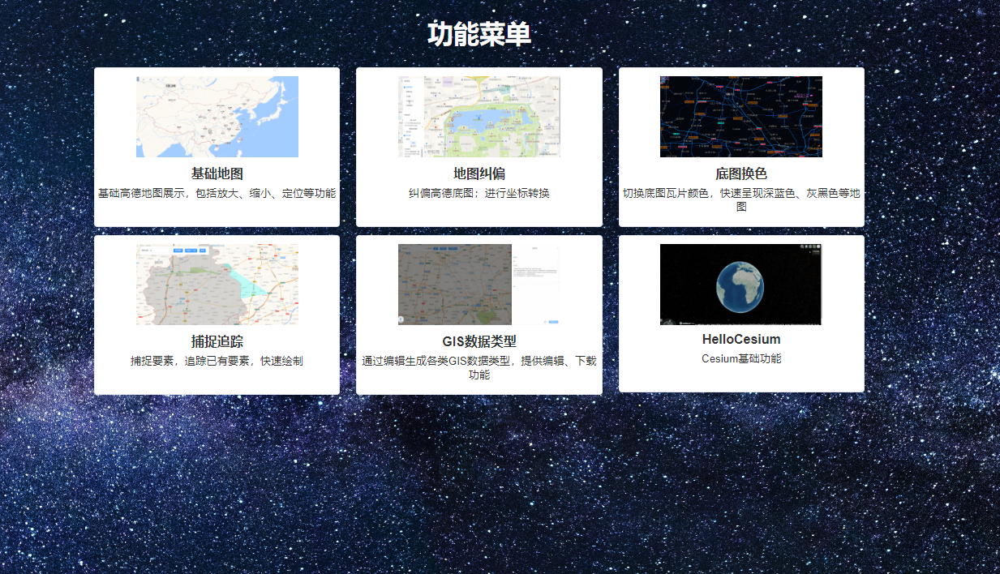

<!--
 * @Author: Dreamice dreamice13@foxmail.com
 * @Date: 2022-06-22 21:44:02
 * @LastEditors: Dreamice dreamice13@foxmail.com
 * @LastEditTime: 2024-01-06 23:33:18
 * @FilePath: \GisShow\README.md
 * @Description: 
-->
# 项目架构
Vite + Vue 3 + JavaScript + Vue Router + Element Plus  
ESLint代码检查

# GIS插件
OpenLayers 7.1.0

# 实现功能

# 待办功能
测量工具